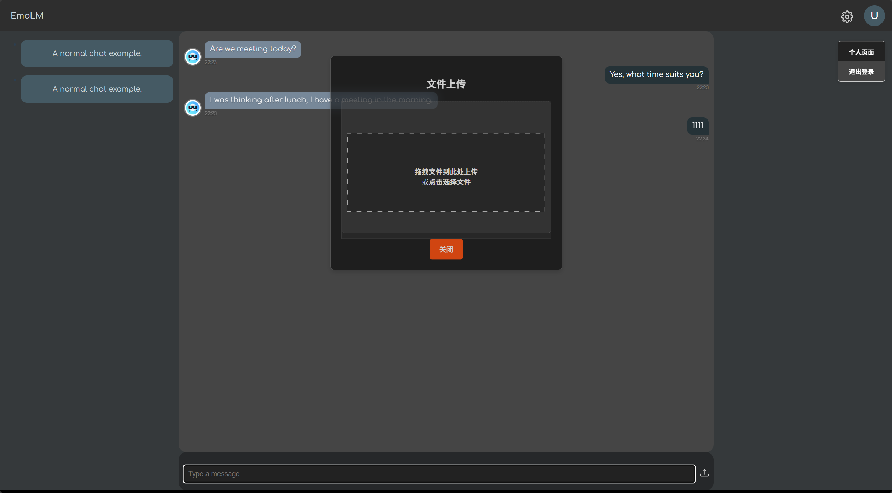

# Technique Used

## Frontend

### Background visual element
GSAP (GreenSock Animation Platform): A JavaScript library for high-performance animations, used to create complex animations for SVG elements, including timeline-based animations and pointer-based interactions.  

SVG (Scalable Vector Graphics): Used for rendering the animated text with masks and transformations, providing scalable and resolution-independent visuals.  

It listen to pointer movement(`window.onpointermove`), use GSAP library to control animation timeline progress based on 
pointer horizontal position `e.x` projection in range of `[0, 1]`: $`\text{progress} = \frac{\text{e.x}}{\text{window.innerWidth}}`$

reference:
https://codepen.io/creativeocean/pen/qEWOgjR
### Animations

#### Title animation on focusing login text input

#### Capsule button and on hover animation

#### Transition animation

#### Dashboard button on hover animation(top, button expand animation)

### Chat message box

#### Chat message controller

#### Chat message box scroller(removed triangle, consistent the capsule scroller)

#### Chat message scroll to bottom at beginning

#### Chat message wrapper: message control in box

### Uploader

#### Upload button/user menu/config menu with icon

#### Uploader for file transfer

#### Uploader page z-index to top

#### Transparent background of Uploader

### Chat message input

#### Chat message sending animation

#### Chat message sending time visualization

### Authentication

#### Router guard: redirect to login page if not logged in

## Backend

### MVC Design

### MySQL/ JDBC connection

### Authentication table design

### Controller with Authentication

#### Email verification

#### Register form / User password with MD5 encryption and add salt

To prevent rainbow table attack...

#### Login form

use COUNT(*) to avoid SQL injection

use typing check to avoid SQL injection

### FileController interact with FileService

#### File cleanup service

### JWT token

#### JWT encode information: uid

#### token placement: header authentication

### ChatMessageController

#### History retrieval by uid

#### Chat Messages retrieval by uid, hid, sorted by inner id

#### Chat Messages send with files attachment

# Demo

## Images

