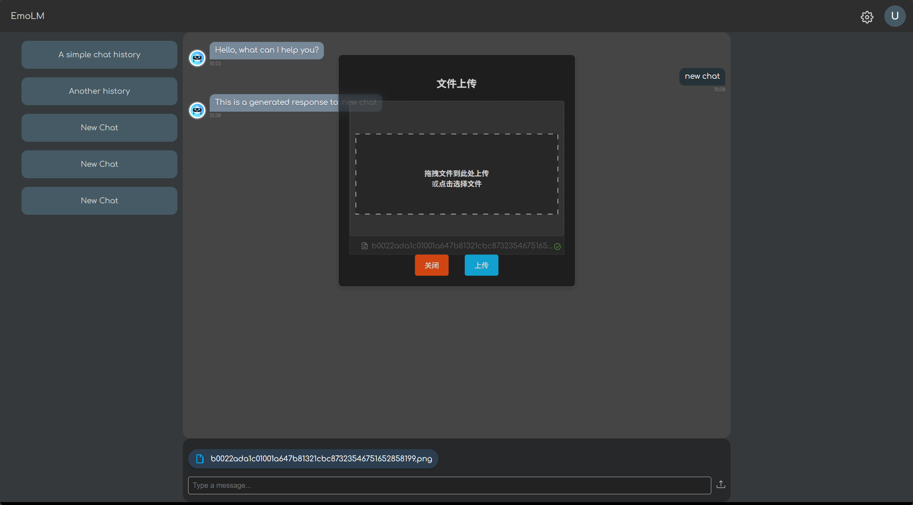

# Technique Used

## Frontend

### Background visual element
GSAP (GreenSock Animation Platform): A JavaScript library for high-performance animations, used to create complex animations for SVG elements, including timeline-based animations and pointer-based interactions.  

SVG (Scalable Vector Graphics): Used for rendering the animated text with masks and transformations, providing scalable and resolution-independent visuals.  

It listen to pointer movement(`window.onpointermove`), use GSAP library to control animation timeline progress based on 
pointer horizontal position `e.x` projection in range of `[0, 1]`: $`\text{progress} = \frac{\text{e.x}}{\text{window.innerWidth}}`$

reference:
https://codepen.io/creativeocean/pen/qEWOgjR

#### Set element to background

### Animations

#### Title animation on focusing login text input

Move title text from text input to the top of the text input.

#### Capsule button and on hover animation

Maybe add some half size capsule button.

#### Transition animation

Transition animation for title, chat message box, chat message input, chat message scroller, chat message list.

#### Dashboard button on hover animation(top, bottom expand to two sides animation)

Should carefully consider the boarder's size and position, which is hard for LLM to understand.

### Chat message box

#### Chat message controller

Control the header redirect to dashboard, login page(logout), the content with navigation list of chat history, a card page of current chat, a card of user input and file upload.

#### Chat message box scroller(removed triangle, consistent the capsule scroller)

#### Chat message scroll to bottom at beginning / switch to different chat page content

Add a function to scroll to bottom. Call no watch query hid changed or at first (mounted).

#### Chat message wrapper: message control in box

Control the message content not  to be too long in one line. split force break when long enough or split by word break.

Maybe add some features of string escape to avoid XSS attack.

Some string feature of parsing URL hyperlink, emoji, etc. can also be added.

#### Chat messages files attachment as cards

#### File previews in right sidebar

#### Upload button/user menu/config menu with icon

### Uploader

#### Uploader for file transfer

Should sync with chat page for file list visualization

#### Uploader page z-index to top

#### Transparent background of Uploader

El-uploader component should adjust :deep el-uploader-dragger

### Chat message input

#### Chat message sending animation

Before size, after size, etc.

#### Chat message sending time visualization

Format time as: `HH:mm` on client side.

### Authentication

#### Router guard: redirect to login page if not logged in

Everytime there is no token in local storage, redirect to login page.

## Backend

### MVC Design

### MySQL/ JDBC connection

### Authentication table design

### Controller with Authentication

#### Email verification

Random verify code, SMTP protocol of 163 mail service.

#### Register form / User password with MD5 encryption and add salt

To prevent rainbow table attack...

#### Login form

Use COUNT(*) to avoid SQL injection.

Use typing check to avoid SQL injection.

### FileController interact with FileService

#### File cleanup service

Clean up files in midnight.

#### TODOs: Link unique id to file for next time utilze

### JWT token

Should introduce JWT here.

#### JWT encode information: uid

Structure of JWT token, sub: username, uid: user.id, exp: expire time

#### token placement: header authentication

RequestHeaders.AUTHORIZATION

### ChatMessageController

#### History retrieval by uid

It returns error on uid not found.

#### Chat Messages retrieval by uid, hid, sorted by inner id(ordered by append time)

Maybe we should add modify service that can update the message.

#### Chat Messages send with files attachment

#### Cross-Origin Resource Sharing

# Demo

## Images

## TODOs

- [ ] Add text input verify
- [ ] Add file upload verify
- [ ] Add settings
- [ ] Add chat message edit
- [ ] Add chat history table update service
- [ ] Add file id for history deserialization
- [ ] Utilize file use in chat
- [ ] Sample chats...
- [ ] Utilize JWT expire time
- [ ] Attach MCP service to LLM (local Emotion-LLaMA or remote LLM, options for users).